# Entropy32 Plus — User Manual

*"The Universe Bifurcator"*

<!-- IMAGE: hero shot — assembled device in its case, screen lit up on the
     collecting screen, Geiger counter cabled in beside it. This is the
     manual's cover image; make it the nicest photo you have. -->
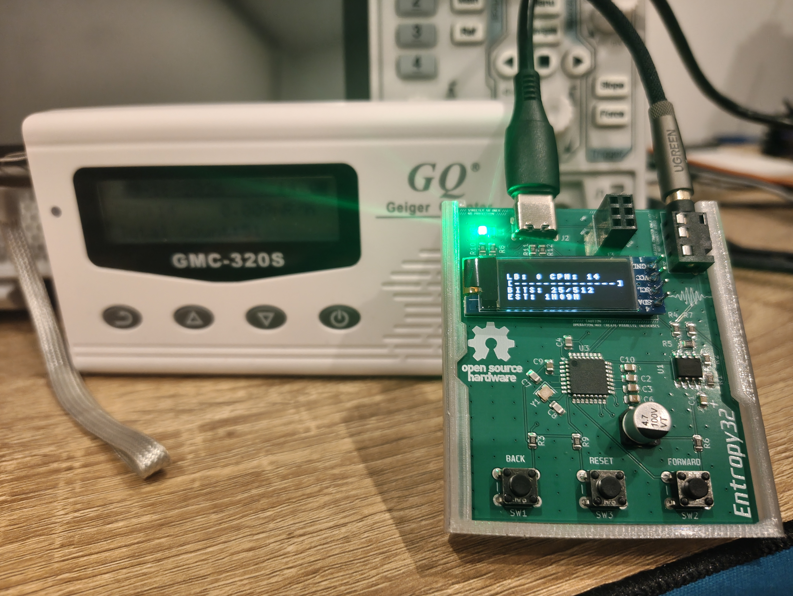
*Geiger counter not included!*

<details>
<summary>Why "The Universe Bifurcator"?</summary>

Every accepted bit this device produces comes from a single radioactive
decay event resolving one of two ways. Under the many-worlds
interpretation of quantum mechanics, that's the moment often described as
reality itself splitting into two branches — one per outcome. Calling the
device "The Universe Bifurcator" is equal parts joke and literal
description: your seed phrase isn't generated by a hardware trick
*pretending* to be random, it's built from actual forks in the universe's
wavefunction. Whether you take the physics interpretation seriously or
not, the entropy is real either way — see the README for how it's
captured and validated.

</details>

This manual covers day-to-day operation: what the buttons do, what each
screen means, and how to generate and record a BIP39 seed phrase. For
build instructions, schematics, and the cryptographic design, see the
[README](./README.md) instead.

---

## Table of contents

1. [Safety and disclaimer](#1-safety-and-disclaimer)
2. [What you need](#2-what-you-need)
3. [Device overview](#3-device-overview)
4. [Controls](#4-controls)
5. [Powering on and boot self-tests](#5-powering-on-and-boot-self-tests)
6. [Generating a seed phrase, step by step](#6-generating-a-seed-phrase-step-by-step)
7. [Screen reference](#7-screen-reference)
8. [Choosing an entropy source](#8-choosing-an-entropy-source)
9. [Troubleshooting](#9-troubleshooting)
10. [Caring for the device](#10-caring-for-the-device)
11. [Getting help](#11-getting-help)

---

## 1. Safety and disclaimer

<!-- IMAGE: none needed here — keep this section text-only so it reads
     like a warning label, not a photo spread. -->

**Radiation safety.** If you use a check source (uranium glass, thoriated
welding rod, a calibration source, etc.) rather than ambient background,
follow the safety and legal handling practices for that specific material
in your region. This device does not shield or contain a source for you —
that is entirely your responsibility.

**Seed security.** This is a hobbyist/educational project.

- Never trust a seed-generating device — this one included — with
  significant funds without independently auditing the hardware and
  firmware yourself.
- The device never stores, transmits, or displays your seed anywhere
  except its own screen, and it has no wireless connectivity — but *you*
  are still responsible for how you record and store it afterward.
- Don't photograph your seed phrase, type it into a computer or phone, or
  say it aloud near a smart speaker. Write it on paper (or stamp it in
  metal) and store that physically.
- If either on-device health check fails during generation, the device
  halts on purpose rather than producing a seed. See
  [Troubleshooting](#9-troubleshooting) — do not override this or
  retry until you understand why it tripped.

## 2. What you need

- The Entropy32 Plus device, assembled and flashed
- A Geiger counter with a 3.5mm pulse output (this device is designed
  around the GQ Electronics GMC-320S)
- A USB-C cable for power
- An entropy source: ambient background radiation works, or a check
  source if you want faster generation (see
  [Choosing an entropy source](#8-choosing-an-entropy-source))
- Something to record your seed phrase on — paper or a metal seed
  backup plate, kept offline

<!-- IMAGE: everything above laid out on a table, unboxing/kit-contents
     style. -->
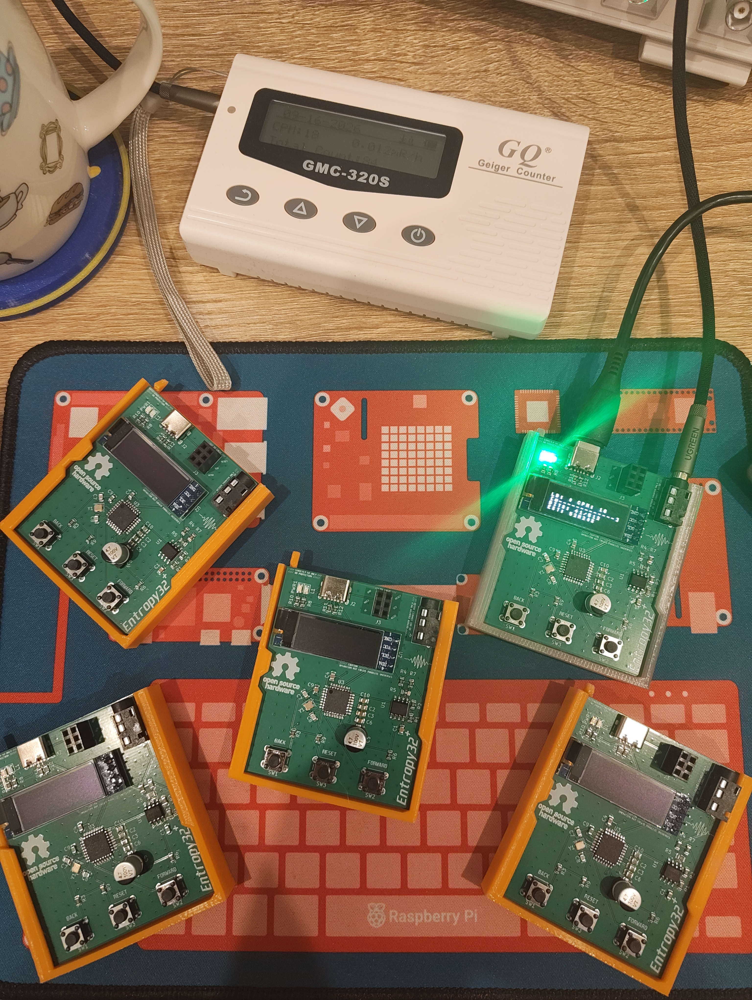
*Collect them all!*

## 3. Device overview

<!-- IMAGE: front of the device, in its case, with callout labels for:
     - OLED display
     - BACK button
     - FWD button
     Use arrows/numbers overlaid on the photo (a tool like Keynote,
     Figma, or even annotate on your phone works fine). -->
<p align="center">
  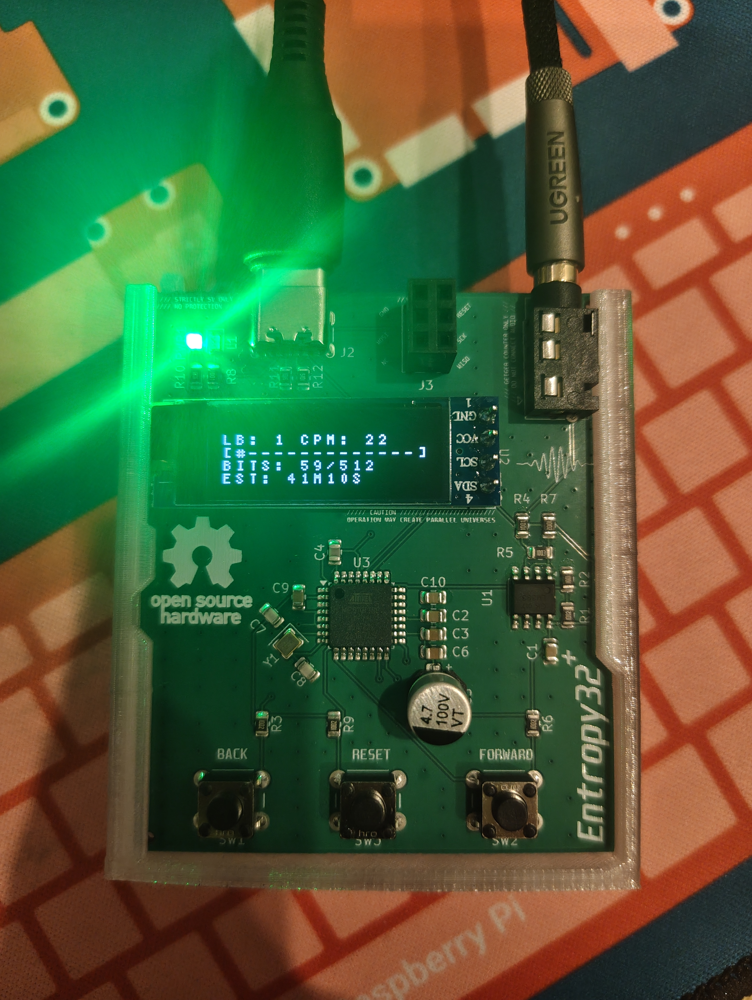
  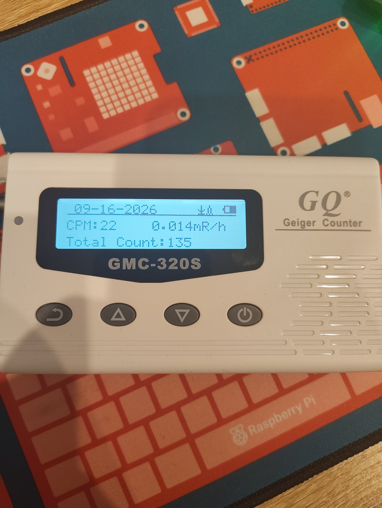
  <br>
  <i>The CPM figure on the Geiger counter should agree with Entropy32 Plus</i>
</p>

<!-- IMAGE: side/back of the device with callouts for:
     - 3.5mm jack (Geiger counter input)
     - USB-C port (power) -->

| Callout | Part | Purpose |
|---|---|---|
| 1 | 0.91" OLED display | Shows collection progress, menus, and your seed phrase |
| 2 | BACK button | Navigate back / toggle menu options |
| 3 | FWD button | Navigate forward / toggle menu options |
| 4 | 3.5mm jack | Connects to your Geiger counter's pulse output |
| 5 | USB-C port | Power only |

## 4. Controls

The entire device is operated with two buttons. There is no text entry
and nothing to configure beyond seed length.

| Action | What it does |
|---|---|
| Press **BACK** alone | Go back / previous page / decrease-toggle |
| Press **FWD** alone | Go forward / next page / increase-toggle |
| Press **BACK + FWD together** | **Select / confirm** |

<!-- IMAGE: close-up of a hand pressing both buttons at once, to make the
     "combo = select" gesture unambiguous. -->

Hold both buttons together for a moment — the device waits briefly to
distinguish "two single presses" from "one combo press," so a firm,
simultaneous press works best.

## 5. Powering on and boot self-tests

Connect your Geiger counter's 3.5mm output to the device, then plug in
the USB-C cable to power it on. On every boot, the device automatically
runs a short sequence of self-tests before it will collect any entropy:

<!-- IMAGE: photo sequence (2-4 shots) of the boot screens in order:
     logo splash -> "BOOTING..." -> "TESTING SHA-256" -> "PASS <hash>"
     -> "CHECK WORDLIST" -> "PASS" -> collecting screen. -->
<p align="center">
  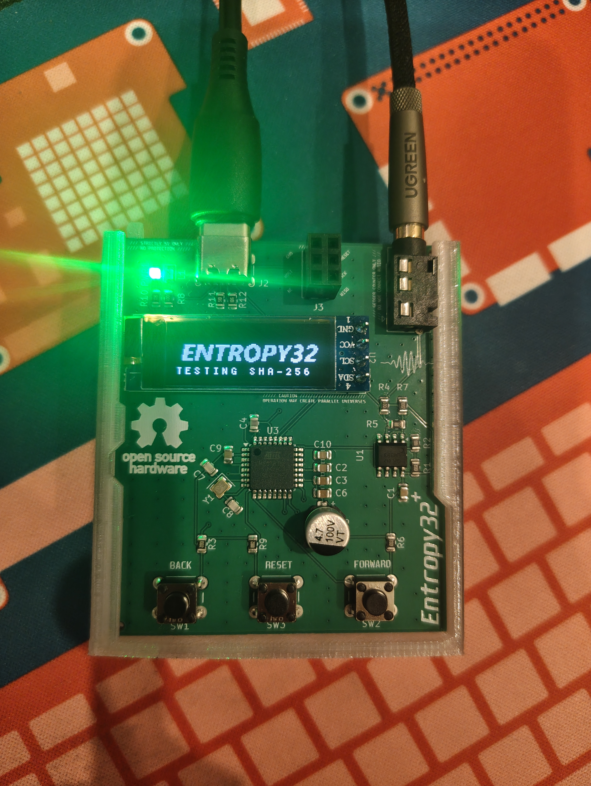
  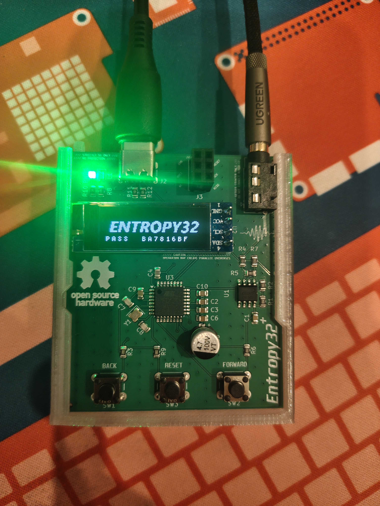
  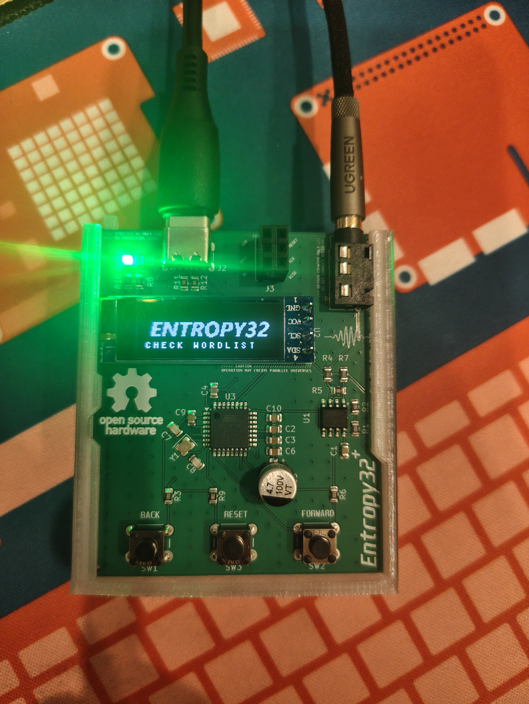
  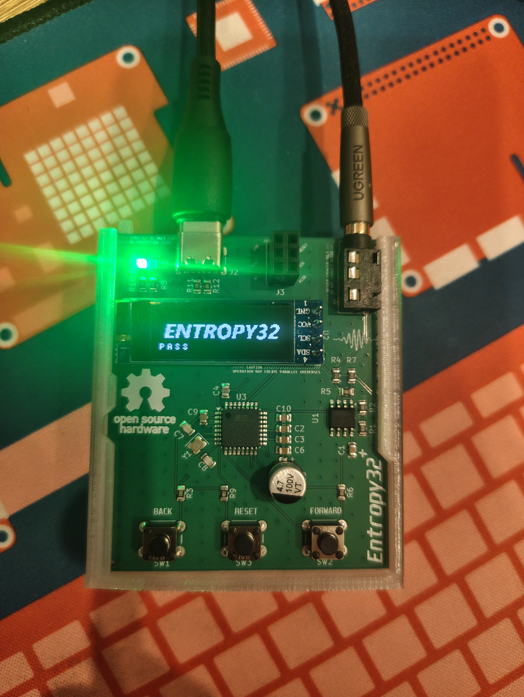
  <br>
  <i>Boot sequence showing health checks passing</i>
</p>

1. **Logo splash** — the boot logo appears briefly.
2. **SHA-256 self-test** — the device hashes a known test string and
   checks the result against the correct answer, confirming its own
   cryptographic conditioning hasn't been broken by a bad build or
   corrupted flash. You'll briefly see `PASS` plus the first few bytes
   of the hash as a visual fingerprint.
3. **Wordlist check** — confirms the built-in BIP39 wordlist is intact.
4. The device moves into the **collecting** screen and begins listening
   for pulses.

If either test fails, the screen shows `FAIL - HALTED` or
`WORDLIST ERROR!` and the device stops responding to input entirely.
See [Troubleshooting](#9-troubleshooting).

## 6. Generating a seed phrase, step by step

### Step 1 — Collect entropy

<!-- IMAGE: the collecting screen, ideally with a Geiger counter visible
     next to it clicking away. A short video/GIF works even better if
     your README rendering target supports it. -->
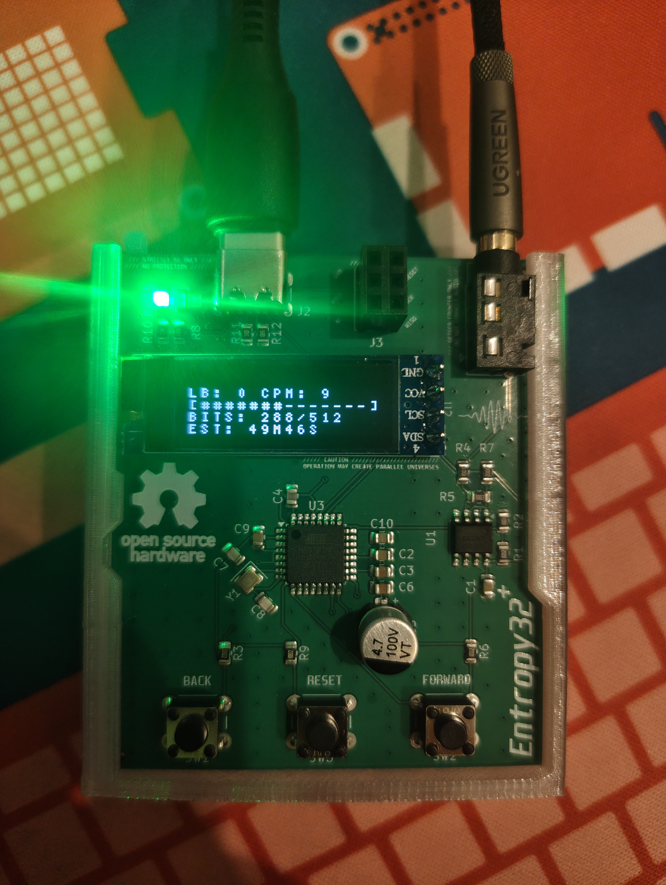

Once booted, the device shows a live collection screen and starts
converting Geiger pulses into raw entropy bits automatically — there's
nothing to press here. Just wait. The screen shows your live pulse rate
and a progress bar; see [Screen reference](#7-screen-reference) for what
each field means. This can take anywhere from under a minute (strong
check source) to over an hour (ambient background) — the on-screen `EST`
field re-estimates the remaining time as data comes in.

### Step 2 — Choose seed length

<!-- IMAGE: the "SEED LENGTH: 12" / "SEED LENGTH: 24" menu screen. -->
<p align="center">
  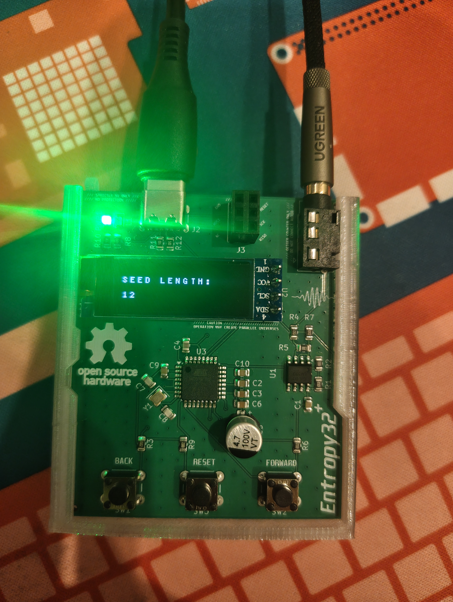
  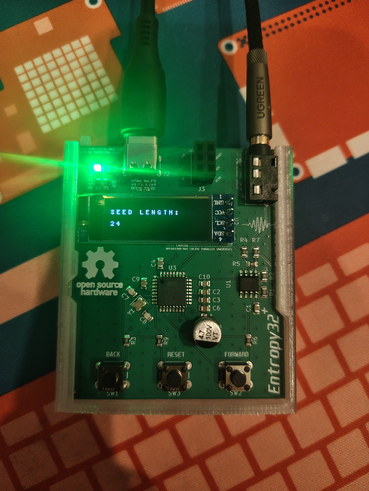
  <br>
  <i>Seed phrase selection menu, user can elect a 12 or 24 word phrase</i>
</p>

Once the pool fills, the device automatically shows a menu:

```
SEED LENGTH:
12
```

Press **BACK** or **FWD** to toggle between `12` and `24` words, then
press **BACK + FWD together** to confirm your choice and generate the
phrase.

### Step 3 — Read your seed phrase

<!-- IMAGE: a word screen, e.g. showing words 01-04, with a hand writing
     the words onto paper alongside it. -->
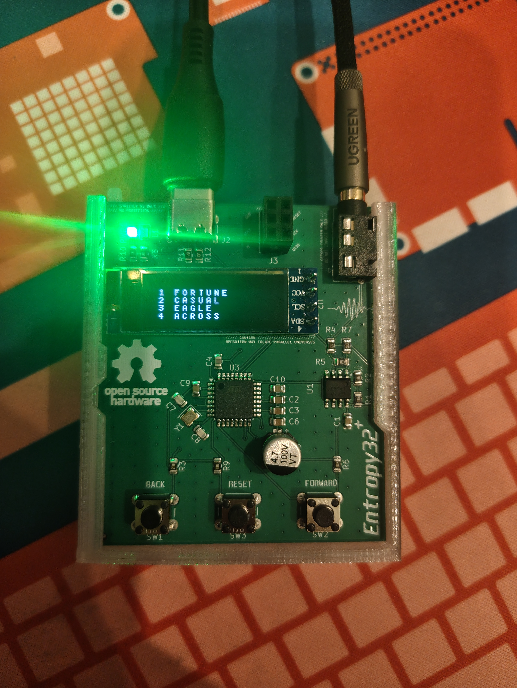

The phrase is shown four words per screen, each numbered by its position
(e.g. `01 ABANDON`). Write each word down, in order, exactly as shown.

- Press **FWD** to go to the next page of words.
- Press **BACK** to go to the previous page (to double check what you
  wrote).
- A 12-word phrase is 3 pages; a 24-word phrase is 6 pages.

Take your time here — there's no timeout, and going back to re-check a
page does not regenerate or change anything.

### Step 4 — Finish and wipe

<!-- IMAGE: the "SEED COMPLETE." screen. -->
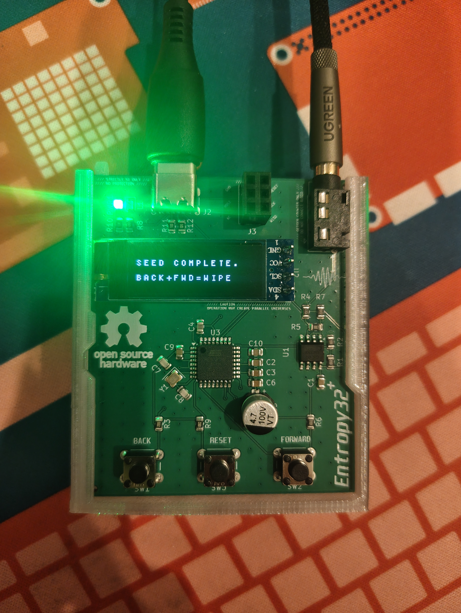

After the last page, the device shows:

```
SEED COMPLETE.
BACK+FWD=WIPE
```

From here:

- Press **BACK** to return to the word screens and review the phrase
  again.
- Press **BACK + FWD together** to move to the wipe confirmation screen.

<!-- IMAGE: the "WIPE SEED NOW?" confirmation screen. -->
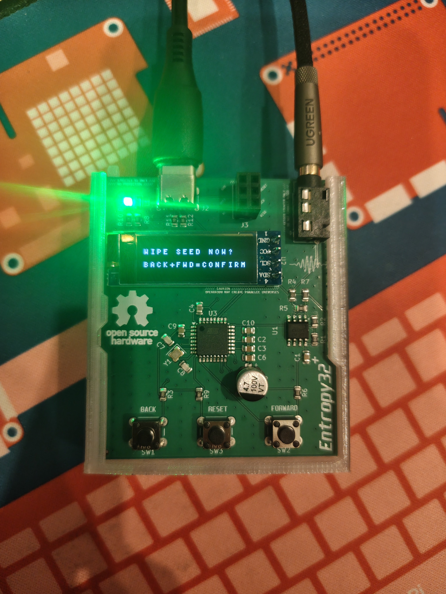

```
WIPE SEED NOW?
BACK+FWD=CONFIRM
```

- Press **BACK + FWD together** again to confirm. The device erases the
  seed from memory and immediately restarts entropy collection for a
  fresh phrase.
- Press **BACK** or **FWD** alone to cancel and return to the completed
  seed screen instead.

**Do not walk away with a generated seed still on screen and unwiped** —
treat the wipe step as part of finishing the job, not optional cleanup.

## 7. Screen reference

### Collecting screen

```
LB: 1 CPM: 42.3K
[#######-------]
BITS: 312/512
EST: 2M15S
```

| Field | Meaning |
|---|---|
| `LB` | Value of the most recently accepted raw bit (`0` or `1`) — a quick liveness check that the source is actually producing data |
| `CPM` | Counts per minute from your Geiger counter, averaged over a rolling 60-second window - this should always match your Geiger counter's own CPM reading except during the first minute of operation |
| Progress bar | Fraction of the raw 512-bit entropy pool collected so far |
| `BITS` | Raw bits collected / 512 needed |
| `EST` | Estimated time remaining, based on current CPM |

### Menu screen

Shows the currently selected seed length (`12` or `24`). Toggle with
either button; confirm with the combo press.

### Word screens

Up to 4 words per screen, each prefixed with its 1-based position in the
phrase. Words are shown in uppercase for legibility on the small screen —
this is a display choice only; write them down however you like, case
doesn't matter for BIP39.

### Done / wipe screens

Text-only confirmation prompts — see [Step 4](#step-4--finish-and-wipe)
above for exactly what each button does on these screens.

## 8. Choosing an entropy source

The device works with any Geiger counter pulse source, but how fast it
fills its entropy pool depends entirely on your counts-per-minute (CPM).
Rough guide (see the README for the underlying math):

| Source | Typical CPM | Time to fill the pool |
|---|---|---|
| Ambient background | ~15–25 CPM | ~40–70 min |
| Uranium glass ("vaseline glass") | ~50–100 CPM | ~10–20 min |
| Thoriated tungsten welding rod (2% ThO₂) | ~100–200 CPM | ~5–10 min |
| Am-241 foil (smoke detector ionization chamber) | ~300–800 CPM | ~1.3–3.5 min |
| Low-activity calibration/check source | ~1,000–3,000 CPM | ~20 sec–1 min |
| High-activity check source (close contact) | ~5,000–10,000+ CPM | ~6–12 sec |

<!-- IMAGE: a couple of example sources next to the Geiger tube — e.g. a
     piece of uranium glass or a welding rod held near the counter — if
     you want to show, not just tell. Follow appropriate safety/legal
     practices for whatever source you photograph. -->

Actual CPM depends heavily on your specific tube, source activity,
distance, and shielding — treat the table as a rough guide, not a spec.

## 9. Troubleshooting

| Symptom | What it means | What to do |
|---|---|---|
| `FAIL - HALTED` at boot | SHA-256 self-test failed — the firmware build is likely corrupted | Re-flash the firmware; power cycle |
| `WORDLIST ERROR!` at boot | The compiled BIP39 wordlist has a corrupted/oversized entry | Regenerate `bip39_wordlist.h` from `tools/generate_wordlist.py` and re-flash |
| Screen never lights up | OLED not detected on the I2C bus | Check the display's I2C wiring/address; the device halts silently rather than running blind if it can't confirm the display |
| `HEALTH TEST FAIL` during collection | The entropy source looked stuck or statistically abnormal (NIST SP 800-90B runtime checks tripped) | Power cycle and try again; check your Geiger counter connection and source placement. Do not treat a health-test halt as a nuisance to bypass — it exists to stop a degraded source from silently producing a weak seed |
| `CPM` reads 0 / `EST` reads `--` | No pulses are being received | Check the 3.5mm cable connection and that your Geiger counter is actually powered on and detecting counts |
| Progress bar stuck | Very low count rate (ambient background can genuinely take an hour+) | Wait, or switch to a stronger source — see [Choosing an entropy source](#8-choosing-an-entropy-source) |
| A button press does nothing | You may be mid-combo-detection window, or the device already halted on a self-test/health-test failure | Press firmly and release; if the screen shows a halt message, this is expected — power cycle |

Any halt state (`FAIL - HALTED`, `WORDLIST ERROR!`, `HEALTH TEST FAIL`)
requires a power cycle to recover — this is intentional, not a bug.

## 10. Caring for the device

<!-- IMAGE: hand holding the case steady while unplugging the USB-C or
     3.5mm cable, demonstrating the warning below. -->

If you're using the included 3D-printed case: hold the board down while
unplugging the USB-C or 3.5mm cable. The case's retention prong resists
the board sliding out, and repeated unplugging without supporting the
board can eventually snap it.

Beyond that, treat it like any small electronics project — avoid static
discharge into the exposed header pins, and don't leave it connected to
an active source indefinitely when not in use.

## 11. Getting help

This is an open-source hobbyist project — see the
[README](./README.md) for hardware design files, firmware source, and
the full technical writeup of how entropy is captured and conditioned.
